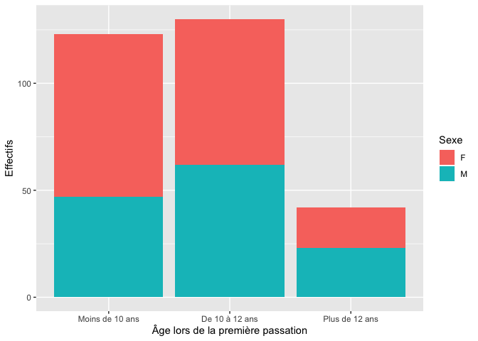
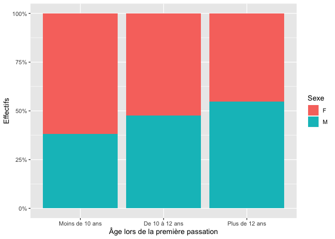
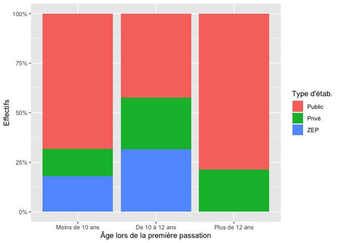
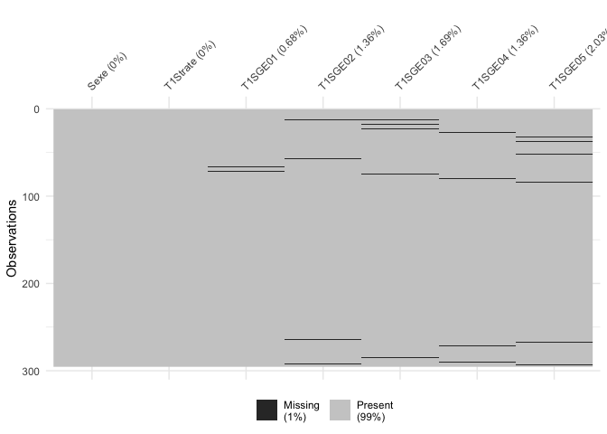
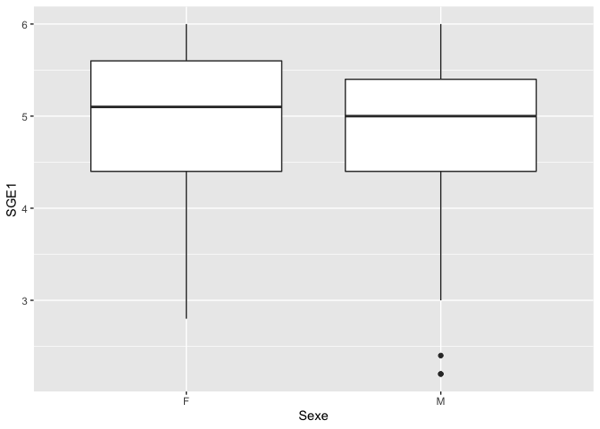

JOUR 1
================

# Introduction :

Le logiciel R est un logiciel gratuit de statistiques. Il repose sur
principalement sur la définition d’objets et sur l’utilisation de
packages ou librairies développées par la communauté statistique
universitaire principalement.

Une interface intéressante pour utiliser R est RStudio. Ouvrez RStudio
puis File -\> New File R Script Vous enregistrez ce stript dans votre
dossier au nom de Jour1.R

## Les calculs de base

Effectuez les calculs suivants : pour que la commande soit effectuée on
clic sur CTRL (ou command) + Enter

``` r
3+1.5*log(2)
```

    ## [1] 4.039721

On peut également définir des variables auxquelles on va affecter des
valeurs puis faire des calculs sur ces variables :

``` r
a<-1.5
b<-3
c<-2
b+a*log(c)
```

    ## [1] 4.039721

# Les vecteurs

## Définition

Un des objets de base de R est le vecteur. De façon simplifiée un
vecteur est un liste de valeurs telle que : toutes les valeurs d’un
vecteur sont du même type (nombre, chaine de caractères principalement).
Pour créer un vecteur on utilise c() pour combine.

``` r
a1<-c(1.5,2,3.2,1.5)
a2<-c("fille","garçon","fille","fille","fille","fille")
a3<-c(TRUE,FALSE,TRUE,TRUE)
```

On peut déterminer la nature du vecteur en utilisant class() :

``` r
class(a1)
```

    ## [1] "numeric"

``` r
class(a2)
```

    ## [1] "character"

``` r
class(a3)
```

    ## [1] "logical"

Exercice :

1)  Peut-on combiner les vecteurs a1 et a2 ?

2)  Essayer de le faire.

3)  Quelle est la classe du résultat ?

## Indexation et longueur d’un vecteur

La fonction length permet de calculer le nombre de valeurs d’un vecteur
(quelle que soit la nature du vecteur considéré).

``` r
length(a1)
```

    ## [1] 4

chaque élément d’un vecteur est repéré par un indice entre \[\].

``` r
a1[1]
```

    ## [1] 1.5

``` r
a1[3]
```

    ## [1] 3.2

``` r
a1[1]+a1[3]
```

    ## [1] 4.7

``` r
a1[1]/a1[3]
```

    ## [1] 0.46875

On peut changer la valeur de a1\[3\] en lui affectant une nouvelle
valeur :

``` r
a1[3]<- -3
a1
```

    ## [1]  1.5  2.0 -3.0  1.5

On peut aussi ajouter de nouvelles valeurs aux vecteurs a1

``` r
a1[5]<-10
a1[6]<-11
```

On peut aussi définir une suite de nombres avec : par exemple b1\<-1:10
crée le vecteur b1 qui contient les entiers de 1 à 10. Faites le et
trouver la classe et la taille du vecteur correspondant.

Trouver une façon équivalente de créer les valeurs précédentes :
a1\[5:6\]\<-\*\*\*\*

## La fonction rep :

Elle permet d’écrire n fois la valeur a : rep(a,n)

``` r
a5<-rep(5,10)
a6<-rep("fille",10)
```

Exercice : créer un vecteur avec 5 fois fille et 10 fois garçon.

## La fonction seq :

On définit une séquence de nombre seq(MIN,MAX,by=x) entre MIN et MAX
avec un pas de x.

``` r
a7<-seq(0,1,by=0.1)
a8<-seq(10,20,by=5)
```

## Les calculs de base avec un vecteur

On peut ajouter, soustraire, multiplier des vecteurs entre eux à
condition qu’ils soient de même longeur et qu’ils soient numériques.

``` r
a1<-seq(10,20,by=1)
a2<-seq(20,30,by=1)
a1+a2
```

    ##  [1] 30 32 34 36 38 40 42 44 46 48 50

``` r
a2-a1
```

    ##  [1] 10 10 10 10 10 10 10 10 10 10 10

``` r
a1*a2
```

    ##  [1] 200 231 264 299 336 375 416 459 504 551 600

``` r
a2/a1
```

    ##  [1] 2.000000 1.909091 1.833333 1.769231 1.714286 1.666667 1.625000
    ##  [8] 1.588235 1.555556 1.526316 1.500000

``` r
a1^2*log(a2)
```

    ##  [1]  299.5732  368.3872  445.1101  529.8985  622.8986  724.2471  834.0727
    ##  [8]  952.4969 1079.6343 1215.5938 1360.4790

## Les fonctions de base dans R

On peut calculer des moyennes, des écarts types, des médianes …

sum(): somme, mean() : moyenne, sd() : écart type, median() ,…

On peut aussi utiliser la fonction summary()

``` r
mean(a1)
```

    ## [1] 15

``` r
sd(a1)
```

    ## [1] 3.316625

``` r
summary(a1)
```

    ##    Min. 1st Qu.  Median    Mean 3rd Qu.    Max. 
    ##    10.0    12.5    15.0    15.0    17.5    20.0

si on veut avoir de l’aide sur une fonction on tape ?mean()

## L’objet NA

NA signifie Not Avalaible (pas disponible) il s’agit donc pour R d’une
valeur manquante. Elle ne doit pas être écrite entre ""

``` r
a1<-c(2,3,4,NA)
length(a1)
```

    ## [1] 4

``` r
sum(a1)
```

    ## [1] NA

``` r
mean(a1)
```

    ## [1] NA

La somme et la moyenne des valeurs de a1 n’est plus calculée du fait de
la présence du NA

``` r
sum(a1,na.rm = TRUE)
```

    ## [1] 9

``` r
mean(a1,na.rm = TRUE)
```

    ## [1] 3

ATTENTION : na.rm=TRUE permet de ne pas tenir compte des NA dans le
calcul, mais il considère de ce fait que le vecteur n’a que 3 valeurs et
non pas 4 \!\!\!\!

# Les data frame

Ce sont les tableaux de données ils sont la base de toutes les analyses
dans R. Ils sont produits dans des tableurs (Excel ou libreoffice) et
doivent être au format .csv. On part de BD.csv que l’on ouvre grâce à
RStudio. On peut commencer par regarder les premières lignes du tableau,
faire un summary.

``` r
head(BD)
summary(BD)
# La première ligne définit les noms des variables accessible par names()
names(BD)
# Description du contenu du tableau
str(BD)
# Nombre de lignes / colonnes / dimension
nrow(BD)
ncol(BD)
dim(BD)
```

IMPORTANT : notre table de données s’appelle BD, il y a des lignes et
des colonnes dans la table de données et chaque élément est donc repéré
par un indice de ligne et de colonne c’est comme pour un vecteur entre
\[\].

``` r
# Pour sélectionner l'élément de la ligne 1 et colonne 2
BD[1,2]
# Pour sélectionner la  colonne 2
BD[,2]
# Pour sélectionner la ligne 4
BD[4,]
# Pour sélectionner une colonne avec son nom
BD[,"T1SGE01"]
# Pour sélectionner un ensemble de colonnes
BD[,c("T1SGE01","T2SGE01","T3SGE01")]
# Pour sélectionner un ensemble de colonnes contigues
BD[,38:42]
# L'utilisation du $
BD$T1TYPEETAB
# Sélectionner plusieurs colonnes 
subset(BD,select=c(Identifiant,Sexe))
# Sélectionner plusieurs colonnes contigues
subset(BD,select=T1SGE01:T1SGE05)
```

## Calculer des âges

Installer la librairie lubridate

``` r
library(lubridate)
```

    ## 
    ## Attaching package: 'lubridate'

    ## The following object is masked from 'package:base':
    ## 
    ##     date

``` r
# ymd() est une fonction qui dit que le format des colonnes est bien date
naiss<-ymd(BD$DateNaissance)
pass1<-ymd(BD$T1DatePassation)
BD$AgeT1<-time_length(interval(naiss,pass1),"years")
```

Créer de même des colonnes avec les âges à la passation 2 et à la 3.

## Catégoriser une variable

On va à partir des variables précédentes créer trois catégories d’âges :
moins de 10 ans, entre 10 et 12 ans et plus de 12
ans.

``` r
# on utilise cut() avec l'argument breaks qui donne tous les intervalles ]a,b]
cut(BD$AgeT1,breaks=c(0,10,12,+Inf))
# Si on ajoute labels
cut(BD$AgeT1,breaks=c(0,10,12,+Inf),labels=c("Moins de 10 ans","De 10 à 12 ans","Plus de 12 ans"))
```

Exercice : ajouter 3 colonnes à BD nommées AgePass1, AgePass2, AgePass3
qui contiendront les catégories précédentes pour les 3 passations.

## Tables de contingence

On veut étudier la répartition selon le sexe des participants dans les
catégories d’âge précédentes on fait

``` r
table(BD$AgePass1,BD$Sexe)
```

    ##                  
    ##                    F  M
    ##   Moins de 10 ans 76 47
    ##   De 10 à 12 ans  68 62
    ##   Plus de 12 ans  19 23

On peut également représenter cette table

``` r
library(ggplot2)
ggplot(BD)+
  aes(x=AgePass1,fill=Sexe)+
  geom_bar()+
  xlab("Âge lors de la première passation")+
  ylab("Effectifs")+
  labs(fill="Sexe")
```

<!-- -->

Si on veut que l’axe des effectifs soit en % il faut utiliser une autre
librairie :

``` r
library(scales)
ggplot(BD)+
  aes(x=AgePass1,fill=Sexe)+
  geom_bar(position = "fill") +
  xlab("Âge lors de la première passation")+
  ylab("Effectifs")+
  labs(fill="Sexe")+
  scale_y_continuous(labels = percent)
```

<!-- -->

# Variables catégorielles et codage :

La variable Strate dans le fichier de données est une variable
catégorielle qui a été codée 1: PUBLIC, 2: PRIVE, 3:ZEP. En l’état, R
pense qu’il s’agit d’une variable numérique :

``` r
summary(BD$T1Strate)
```

    ##    Min. 1st Qu.  Median    Mean 3rd Qu.    Max. 
    ##   1.000   1.000   1.000   1.631   2.000   3.000

``` r
# On va la déclarer comme facteur
BD$T1Strate<-factor(BD$T1Strate)
# Si on refait summary on voit que la variable a changé de statut :
summary(BD$T1Strate)
```

    ##   1   2   3 
    ## 172  60  63

``` r
# On peut lui préciser des labels pour les différents niveaux 
BD$T1Strate<-factor(BD$T1Strate,levels=1:3,labels=c("Public","Privé","ZEP"))
summary(BD$T1Strate)
```

    ## Public  Privé    ZEP 
    ##    172     60     63

Exercice : Reproduire le graphique suivant

<!-- -->

# Le problème (difficile) des valeurs manquantes

On va s’intéresser à la variable SGE mesurée en T1 par 5 items (25 à 29
dans la base). Créer une nouvelle base avec ces 5 colonnes + la colonne
Âge + la colonne Strate en T1. Ce data.frame sera BD\_SGE

    ## [1] 295   7

``` r
library(naniar)
vis_miss(BD_SGE)
```

<!-- -->

On constate qu’il y a très peu de valeurs manquantes dans cette
situation.

On peut utiliser na.omit() qui va éliminer tous les individus ayant au
moins une valeur manquante. Ceci peut avoir un gros impact sur le nombre
d’inidividus donc ce n’est pas à utiliser systématiquement \!

``` r
BD2_SGE<-na.omit(BD_SGE)
dim(BD2_SGE)
```

    ## [1] 275   7

Ici cela éliminerait 20 individus.

``` r
nb.na<-apply(is.na(BD_SGE),1,sum)
which(nb.na>=1)
```

    ##  13  18  23  27  32  37  52  57  66  72  75  80  84 264 267 271 285 290 
    ##  13  18  23  27  32  37  52  57  66  72  75  80  84 264 267 271 285 290 
    ## 292 293 
    ## 292 293

``` r
which(nb.na>=2)
```

    ## 13 
    ## 13

Exercice : reprenez BD et utiliser la même procédure pour déterminer le
nombre de
na

## Calcul de score avec des valeurs manquantes

``` r
# La fonction moy ci dessous renverra pour un vecteur donné x NA si il contient plus de 10% de valeurs manquantes ou sinon la moyenne des valeurs de x.
moy<-function(x,p=.10){
  if (mean(is.na(x))>p) return(NA) else{
    return(mean(x,na.rm=TRUE))
  }
}
```

Utilisation de la fonction sur la variable
SGE

``` r
# La fonction apply(X,MARGIN,FUN) applique la fonction FUN  à un data.frame X soit sur ses lignes (MARGIN=1) ou ses colonnes (MARGIN=2)
BD$SGE1<-apply(subset(BD,select=T1SGE01:T1SGE05),1,moy)
```

De même, créer les colonnes :

  - SGE2 et SGE3

  - RE1, RE2, RE3 : relation à l’enseignant aux trois temps de mesure
    (items 5,11,17,23,29 de BE)

  - Sec1, Sec2, Sec3 : sentiment de sécurité aux trois temps de mesure
    (items 6,12,18,24,30)

  - SEP2, SEP3 : sentiment d’efficacité personnelle aux trois temps de
    mesure

# Enregistrer la nouvelle base en csv :

Pour enregistrer votre nouvelle base de données on va utiliser la
fonction write.csv()

``` r
write.csv(BD,file="~/Nextcloud/Formation doctorale/BD2.csv")
```

# Graphiques (suite)

## Graphiques de corrélations

``` r
library(GGally)
```

    ## Registered S3 method overwritten by 'GGally':
    ##   method from   
    ##   +.gg   ggplot2

``` r
ggpairs(subset(BD,select=SGE1:SGE3))
```

    ## Warning: Removed 20 rows containing non-finite values (stat_density).

    ## Warning in (function (data, mapping, alignPercent = 0.6, method =
    ## "pearson", : Removed 20 rows containing missing values

    ## Warning in (function (data, mapping, alignPercent = 0.6, method =
    ## "pearson", : Removed 20 rows containing missing values

    ## Warning: Removed 20 rows containing missing values (geom_point).
    
    ## Warning: Removed 20 rows containing missing values (geom_point).

<!-- -->

``` r
ggpairs(subset(BD,select=c(Sexe,SGE1:SGE3)),
        mapping=ggplot2::aes(colour=Sexe))
```

    ## Warning: Removed 20 rows containing non-finite values (stat_boxplot).

    ## `stat_bin()` using `bins = 30`. Pick better value with `binwidth`.

    ## Warning: Removed 20 rows containing non-finite values (stat_bin).

    ## Warning: Removed 20 rows containing non-finite values (stat_density).

    ## Warning in (function (data, mapping, alignPercent = 0.6, method =
    ## "pearson", : Removed 20 rows containing missing values

    ## Warning in (function (data, mapping, alignPercent = 0.6, method =
    ## "pearson", : Removed 20 rows containing missing values

    ## `stat_bin()` using `bins = 30`. Pick better value with `binwidth`.

    ## Warning: Removed 20 rows containing missing values (geom_point).

    ## `stat_bin()` using `bins = 30`. Pick better value with `binwidth`.

    ## Warning: Removed 20 rows containing missing values (geom_point).

<!-- -->

## Boxplots

``` r
ggplot(BD, aes(x=Sexe, y=SGE1)) + 
  geom_boxplot()
```

    ## Warning: Removed 20 rows containing non-finite values (stat_boxplot).

<!-- -->
